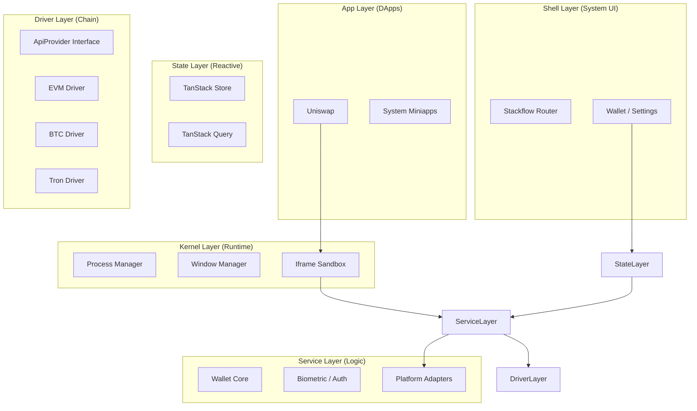

# Architecture Map

KeyApp follows a **Layered Architecture** inspired by Operating System design.

## Directory Mapping

The documentation structure strictly mirrors the codebase:

| Architecture Layer | Code Path | Documentation Book |
| :--- | :--- | :--- |
| **Kernel** | `src/services/miniapp-runtime` | [`01-Kernel-Ref`](../01-Kernel-Ref) |
| **Drivers** | `src/services/chain-adapter` | [`02-Driver-Ref`](../02-Driver-Ref) |
| **UI System** | `src/components/ui`, `src/styles` | [`03-UI-Ref`](../03-UI-Ref) |
| **Platform** | `src/services/{biometric,camera,...}` | [`04-Platform-Ref`](../04-Platform-Ref) |
| **State** | `src/stores`, `src/queries` | [`05-State-Ref`](../05-State-Ref) |
| **Wallet Logic** | `src/services/wallet`, `src/services/transaction` | [`10-Wallet-Guide`](../10-Wallet-Guide) |
| **DApps** | `src/components/ecosystem` | [`11-DApp-Guide`](../11-DApp-Guide) |
| **Shell** | `src/stackflow` | [`12-Shell-Guide`](../12-Shell-Guide) |
| **DevOps** | `vite.config.ts`, `.github` | [`90-DevOps`](../90-DevOps) |
