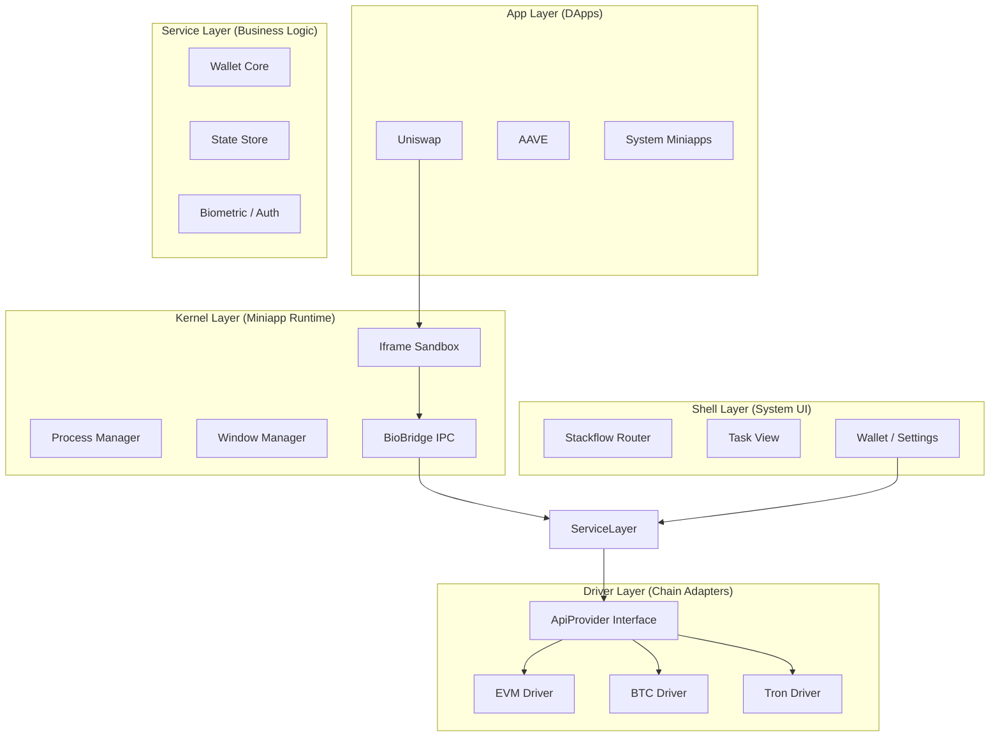

# 03. 宏观架构图 (Architecture Map)

KeyApp 遵循典型的 **分层架构 (Layered Architecture)**，模仿操作系统的设计。

## 目录映射

| 架构层级 | 对应代码目录 | 对应文档 |
| :--- | :--- | :--- |
| **Kernel** | `src/services/miniapp-runtime` | `01-Kernel-Ref` |
| **Shell** | `src/stackflow` | `03-Shell-Guide` |
| **Service** | `src/services/*`, `src/stores` | `10-Wallet-Guide` |
| **Driver** | `src/services/chain-adapter` | `02-Driver-Ref` |
| **UI** | `src/components`, `src/styles` | `03-UI-Ref` |
