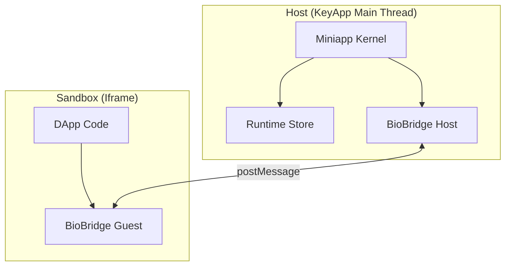

# 00. 内核架构全景 (Kernel Overview)

KeyApp 的内核 (`miniapp-runtime`) 是一个运行在浏览器主线程中的 **微内核 (Micro-Kernel)**。它的主要职责不是处理业务逻辑，而是管理 **进程 (Process)** 和 **资源 (Resource)**。

## 核心组件

1.  **Process Manager**: 维护所有 DApp 的生命周期 (`MiniappInstance`)。
2.  **Window Manager**: 管理所有可见窗口 (`MiniappPresentation`) 及其 Z-Order 和动画。
3.  **Iframe Sandbox**: 为每个 DApp 创建隔离的执行环境。
4.  **BioBridge**: 提供宿主 (Host) 与微应用 (Miniapp) 之间的安全通信通道。

## 架构图

## 设计哲学

*   **UI as a Function of State**: 内核本身是一个基于 TanStack Store 的状态机。所有的 UI 变化（如窗口打开、关闭）都是状态变更的副作用。
*   **Isolation by Default**: 默认情况下，DApp 无法访问任何系统资源，必须通过 Bridge 请求权限。
