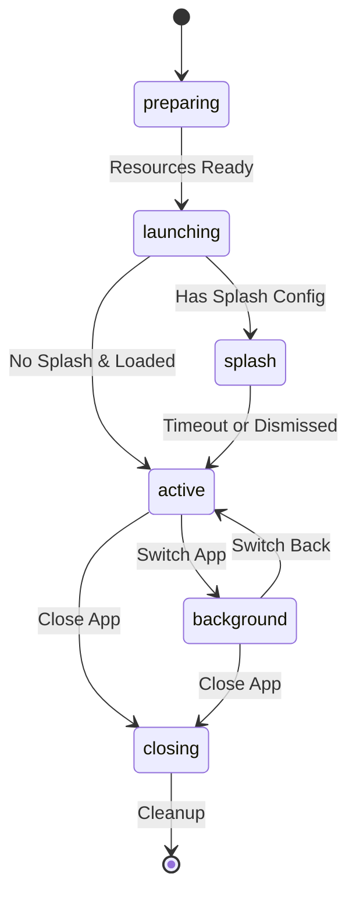

# 01. 进程状态机 (Process State Machine)

Code: `src/services/miniapp-runtime/types.ts`

KeyApp 中的每个微应用都有一个严格的状态机。理解这个状态机对于开发 Runtime 至关重要。

## 状态定义 (`MiniappState`)

| 状态 | 描述 | 触发条件 |
| :--- | :--- | :--- |
| **preparing** | 准备中 | 用户点击图标，内核开始检查资源 (Icon, Slot, Iframe) |
| **launching** | 启动中 | 资源就绪，开始创建 iframe 并加载 URL |
| **splash** | 闪屏页 | 应用配置了 splash screen，且正在加载中 |
| **active** | 前台激活 | 应用加载完成，且处于前台，可交互 |
| **background** | 后台运行 | 用户切换到其他应用，iframe 被隐藏但未销毁 |
| **closing** | 关闭中 | 用户关闭应用，正在执行退出动画 |

## 状态流转图

## Flow vs State

除了静态的 `state`，我们还有一个 `flow` 属性，用于描述 **动画方向**：
*   `opening` / `opened`
*   `backgrounding` / `backgrounded`
*   `foregrounding`
*   `closing`

UI 层通过监听 `flow` 来决定播放哪种 FLIP 动画。
