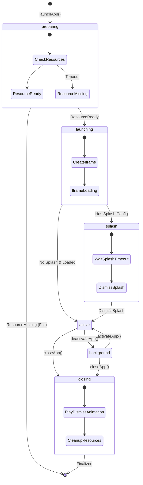

<!--
Type: Reference
Area: Kernel
Code Source: src/services/miniapp-runtime/types.ts
-->

# 01. 进程状态机 (Process State Machine)

KeyApp 的微应用运行时 (`miniapp-runtime`) 采用严格的**有限状态机 (FSM)** 来管理应用生命周期。这确保了应用在资源受限环境下的可预测行为。

## 核心状态 (`MiniappState`)

状态机包含 6 个互斥状态。任何时刻，一个应用实例 (`MiniappInstance`) 只能处于其中一种状态。

| 状态 | 定义 | 资源占用 | 可交互性 |
| :--- | :--- | :--- | :--- |
| `preparing` | **准备中**。内核正在检查启动所需的资源（Icon Ref, Slot Ref, Iframe Ref）。如果资源未就绪，启动流程会被中止。 | 低 | 无 |
| `launching` | **启动中**。资源已就绪，iframe 正在加载 (`loading`)，但尚未触发 `load` 事件。 | 高 (CPU/Net) | 无 |
| `splash` | **闪屏页**。iframe 可能已加载，但根据 Manifest 配置，展示系统级 Splash Screen 以掩盖初始化过程。 | 高 | 无 |
| `active` | **前台激活**。应用处于前台，iframe 可见且获得输入焦点。这是应用的正常运行状态。 | 高 | **有** |
| `background` | **后台运行**。应用被切换到后台。iframe 被移动到隐藏容器 (`visibility: hidden`)，但在内存中保活。 | 中 (Memory) | 无 |
| `closing` | **关闭中**。用户请求关闭，系统正在播放退出动画。动画结束后，所有资源将被释放。 | 中 | 无 |

## 状态流转图 (State Transitions)



## 动画流 (`MiniappFlow`)

除了生命周期状态，内核还维护一个 `flow` 属性，专门用于描述**视觉过渡的方向性**。这对于实现流畅的 FLIP 动画至关重要。

### 状态 vs 流

*   **State**: 描述应用的逻辑状态（存活/死亡/前台/后台）。
*   **Flow**: 描述应用在状态切换时的视觉表现。

### Flow 枚举

*   `opening`: 图标 -> 窗口 (展开)
*   `opened`: 窗口静止 (稳定态)
*   `backgrounding`: 窗口 -> 图标 (收缩)
*   `backgrounded`: 隐藏 (稳定态)
*   `foregrounding`: 图标 -> 窗口 (再次展开)
*   `closing`: 窗口 -> 消失 (销毁)

> [!NOTE]
> `flow` 属性通常由 UI 层（如 `MiniappWindow.tsx`）监听，用于触发 CSS Transition 或 Framer Motion 动画。动画完成后，UI 层会回调内核的 `settleFlow()` 方法，将 `opening` 修正为 `opened`。

## 代码实现

状态转换逻辑集中在 `updateAppState` 函数中：

```typescript
// src/services/miniapp-runtime/index.ts

function updateAppState(appId: string, state: MiniappState): void {
  miniappRuntimeStore.setState((s) => {
    const app = s.apps.get(appId)
    if (!app) return s

    // 根据前一个状态和新状态，推导 flow
    const flow = deriveFlow(app.state, state)
    
    const newApps = new Map(s.apps)
    newApps.set(appId, { ...app, state, flow })

    return { ...s, apps: newApps }
  })

  // 广播事件
  emit({ type: 'app:state-change', appId, state })
}
```
