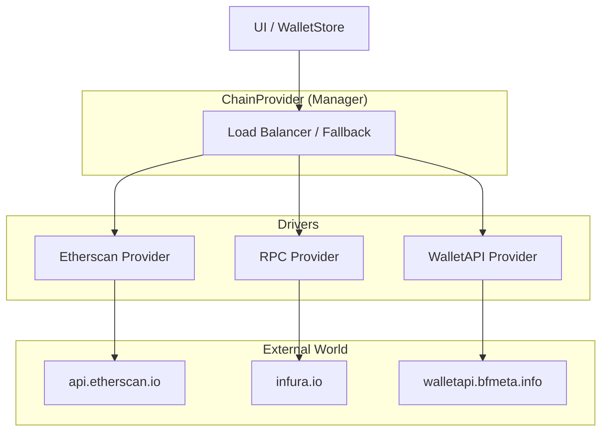

# 00. 适配层架构 (Overview)

Code: `src/services/chain-adapter/`

为了支持多链 (EVM, UTXO, TVM)，KeyApp 引入了一个抽象层，称为 **Driver Layer (或 HAL)**。

## 核心概念

### 1. ApiProvider (Driver)
每个 Provider 代表一个特定的数据源驱动。
*   例如：`EtherscanProvider`, `EvmRpcProvider`, `MempoolProvider`。
*   职责：负责与具体的后端 API 通信，并规范化数据格式。

### 2. ChainProvider (Manager)
每个链 (`chainId`) 拥有一个 `ChainProvider` 实例。
*   职责：聚合该链配置下的所有 `ApiProvider`。
*   策略：实现 **Fallback** 逻辑。如果 Etherscan 挂了，自动切换到 RPC。

### 3. Registry (Factory)
负责根据 `default-chains.json` 的配置，动态实例化对应的 Providers。

## 架构图

