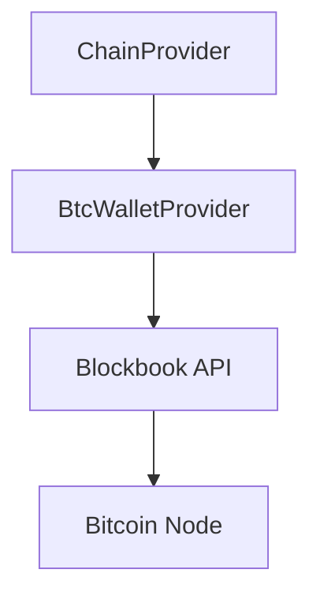

# Bitcoin Provider (UTXO)

## Overview

The `BtcWalletProvider` implements the `ApiProvider` interface for Bitcoin-like UTXO chains. It relies on a Blockbook-compatible backend API (btcwallet) to fetch balances and transaction history.

## Architecture



## Implementation Details

### Class Structure

- **Class**: `BtcWalletProvider`
- **Implements**: `ApiProvider`
- **Location**: `src/services/chain-adapter/providers/btcwallet-provider.ts`

### Key Features

1. **Native Balance**:
   - Fetches balance via `/api/v2/address/{address}`.
   - Combines `balance` (confirmed) and `unconfirmedBalance`.
   - Caching: 60 seconds.

2. **Transaction History**:
   - Fetches history via `/api/v2/address/{address}?details=txs`.
   - Parses inputs (`vin`) and outputs (`vout`) to determine direction and net value.
   - Supports pagination (limit).
   - Caching: 5 minutes.

### Data Models

#### Blockbook Response Schemas

- `BlockbookAddressInfoSchema`: Contains balance and transaction list.
- `BlockbookTxSchema`: Detailed transaction info (inputs, outputs, block height).

#### Logic: Direction & Value

The provider calculates the net value change for the user's address to determine the transaction direction:

- **Incoming (`in`)**: Net value > 0.
- **Outgoing (`out`)**: Net value < 0.
- **Self (`self`)**: Net value = 0 (e.g., consolidation).

```typescript
const inSum = sumValues(tx.vin, address)
const outSum = sumValues(tx.vout, address)
const net = outSum - inSum
```

## Configuration

- **Type**: `btcwallet-v1`
- **Endpoint**: URL of the Blockbook API (e.g., `https://btc.bioforest.io`).
- **Chain ID**: Passed during initialization to fetch symbol and decimals.

## Caching Strategy

| Data | TTL | Invalidation Tags |
|------|-----|-------------------|
| Balance | 60s | `balance:{chainId}:{address}` |
| History | 5m | `txhistory:{chainId}:{address}` |

## Error Handling

- Validates API responses using Zod schemas (`BlockbookErrorSchema`, `BlockbookAddressInfoSchema`).
- Throws specific errors for API failures or invalid data.

## Future Improvements

- [ ] Support for XPUB derived addresses.
- [ ] Fee estimation via Blockbook.
- [ ] Raw transaction broadcasting.
