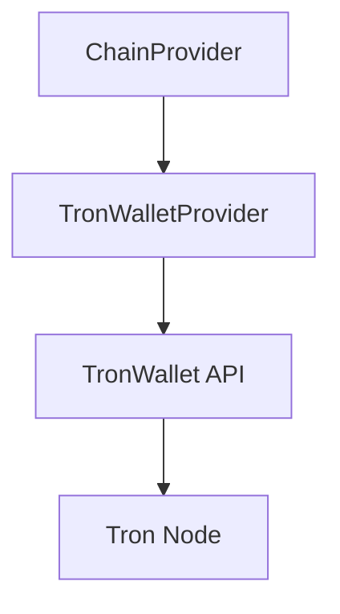

# Tron Provider (TVM)

> **Code Source**: `src/services/chain-adapter/providers/tronwallet-provider.effect.ts`
> **API Spec**: `docs/white-book/99-Appendix/05-API-Providers.md#波场-api`

## Overview

The `TronWalletProviderEffect` implements the `ApiProvider` interface for the Tron blockchain. It interacts with `tronwallet-v1` (walletapi.bfmeta) to handle native (TRX) and TRC20 token operations.

## Architecture

## Implementation Details

### Class Structure

- **Class**: `TronWalletProviderEffect`
- **Implements**: `ApiProvider`
- **Location**: `src/services/chain-adapter/providers/tronwallet-provider.effect.ts`

### Key Features

1. **Native Balance**:
   - Fetches TRX balance via `/wallet/tron/balance`.
   - Supports Base58 + Hex address conversion.
   - Caching handled by `httpFetchCached`.

2. **Transaction History**:
   - Aggregates data from two endpoints:
     - Native: `/wallet/tron/trans/common/history`
     - TRC20: `/wallet/tron/trans/trc20/history`
   - Merges and sorts transactions by timestamp.
   - Deduplicates native transactions triggered by TRC20 transfers.

3. **Token Balances (Local Mix)**:
   - Uses `/wallet/tron/contract/tokens` to obtain TRC20 contract list (TTL cache).
   - Batches balances via `/wallet/tron/account/balance/v2` with `contracts[]`.
   - Mixes native + TRC20 balances into a single output list.

4. **Create & Broadcast**:
   - Native transfer uses `/wallet/tron/trans/create` + `/wallet/tron/trans/broadcast`
   - TRC20 transfer uses `/wallet/tron/trans/contract` + `/wallet/tron/trans/trc20/broadcast`

### Address Handling

Tron uses a dual-format address system. The provider includes utilities for conversion:

- **Base58 (T-address)**: User-friendly format (e.g., `T9yD14Nj9j7...`).
- **Hex**: Internal format used by the API (starts with `41...`).

Utilities:
- `tronAddressToHex(address)`: Converts Base58 to Hex.
- `tronHexToAddress(address)`: Converts Hex to Base58.

### Data Models

#### Response Schemas

- `TronNativeTxSchema`: Standard TRX transfers.
- `TronTrc20TxSchema`: Token transfers (USDT, etc.).
- `TronHistorySchema`: Wrapper for API responses.

#### Logic: TRC20 vs Native

TRC20 transfers often generate a corresponding native transaction record. The provider intelligently merges them:

1. Fetches both Native and TRC20 history.
2. Maps TRC20 transfers by Transaction ID (`txID`).
3. Iterates through Native transactions:
   - If a matching TRC20 record exists, it takes precedence (richer data).
   - If not, it's treated as a standard TRX transfer.
4. Appends any remaining orphan TRC20 transfers.

## Configuration

- **Type**: `tronwallet-v1`
- **Endpoint**: URL of the TronWallet API proxy.
- **Chain ID**: Passed during initialization.

## Caching Strategy

Caching is controlled by `httpFetchCached` and depends on source usage and `forceRefresh`.

## Error Handling

- **Schema Validation**: Ensures API responses match expected schemas.
- **Upstream Errors**: Non-2xx responses throw `HttpError`.

## Reference

- Legacy service: `/Users/kzf/Dev/bioforestChain/legacy-apps/libs/wallet-base/services/wallet/tron/tron.service.ts`

## Future Improvements

- [ ] TRC10 token support.
- [ ] Energy/Bandwidth estimation.
- [ ] Smart contract interaction beyond TRC20.
