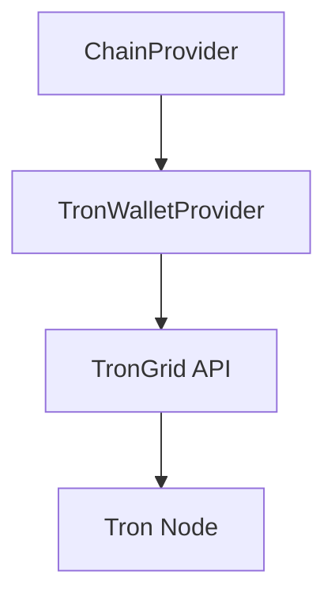

# Tron Provider (TVM)

> **Code Source**: [`src/services/chain-adapter/providers/tronwallet-provider.ts`](../../../../src/services/chain-adapter/providers/tronwallet-provider.ts)

## Overview

The `TronWalletProvider` implements the `ApiProvider` interface for the Tron blockchain. It interacts with a TronGrid-compatible API to handle native (TRX) and TRC20 token operations.

## Architecture

## Implementation Details

### Class Structure

- **Class**: `TronWalletProvider`
- **Implements**: `ApiProvider`
- **Location**: [`src/services/chain-adapter/providers/tronwallet-provider.ts`](../../../../src/services/chain-adapter/providers/tronwallet-provider.ts)

### Key Features

1. **Native Balance**:
   - Fetches TRX balance via `/balance`.
   - Supports both Base58 and Hex address formats.
   - Caching: 60 seconds.

2. **Transaction History**:
   - Aggregates data from two endpoints:
     - Native: `/trans/common/history`
     - TRC20: `/trans/trc20/history`
   - Merges and sorts transactions by timestamp.
   - Deduplicates native transactions triggered by TRC20 transfers.
   - Caching: 5 minutes.

### Address Handling

Tron uses a dual-format address system. The provider includes utilities for conversion:

- **Base58 (T-address)**: User-friendly format (e.g., `T9yD14Nj9j7...`).
- **Hex**: Internal format used by the API (starts with `41...`).

Utilities:
- `tronBase58ToHex(address)`: Converts Base58 to Hex.
- `toTronBase58Address(address)`: Ensures Base58 format for UI display.

### Data Models

#### Response Schemas

- `TronNativeTxSchema`: Standard TRX transfers.
- `TronTrc20TxSchema`: Token transfers (USDT, etc.).
- `TronHistorySchema`: Wrapper for API responses.

#### Logic: TRC20 vs Native

TRC20 transfers often generate a corresponding native transaction record. The provider intelligently merges them:

1. Fetches both Native and TRC20 history.
2. Maps TRC20 transfers by Transaction ID (`txID`).
3. Iterates through Native transactions:
   - If a matching TRC20 record exists, it takes precedence (richer data).
   - If not, it's treated as a standard TRX transfer.
4. Appends any remaining orphan TRC20 transfers.

## Configuration

- **Type**: `tronwallet-v1`
- **Endpoint**: URL of the Tron API proxy.
- **Chain ID**: Passed during initialization.

## Caching Strategy

| Data | TTL | Invalidation Tags |
|------|-----|-------------------|
| Balance | 60s | `balance:{chainId}:{address}` |
| History | 5m | `txhistory:{chainId}:{address}` |

## Error Handling

- **Zod Validation**: Ensures API responses match expected schemas.
- **Upstream Errors**: Throws `Upstream API error` if the API reports failure.

## Future Improvements

- [ ] TRC10 token support.
- [ ] Energy/Bandwidth estimation.
- [ ] Smart contract interaction beyond TRC20.
