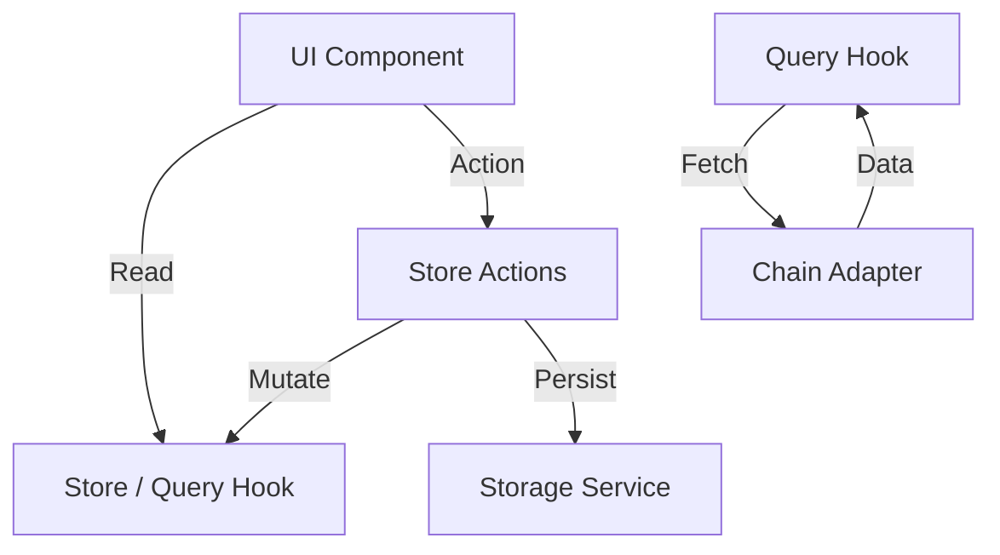

# State Management Reference

## Overview

State management in KeyApp is handled by a combination of `TanStack Store` (global client state) and `TanStack Query` (server/async state).

## Architecture

- **Stores (`src/stores`)**: Synchronous client state (Wallet list, Preferences). Persisted to IndexedDB or LocalStorage where appropriate.
- **Queries (`src/queries`)**: Asynchronous server state (Balances, Transactions, Prices). Handles caching, deduplication, and background updates.

## Data Flow

