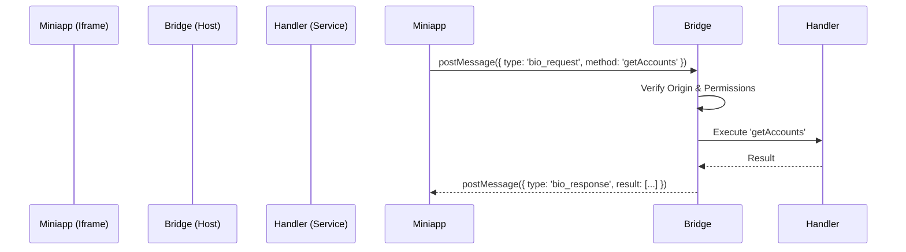

# PostMessage Bridge

> **Code Source**: [`src/services/ecosystem/bridge.ts`](https://github.com/BioforestChain/KeyApp/blob/main/src/services/ecosystem/bridge.ts)

## Overview

The `PostMessageBridge` acts as the communication channel between the KeyApp Host and sandboxed Miniapps (running in iframes). It routes messages based on protocol type (`bio`, `eth`, `tron`).

## Architecture

## Protocol Support

### 1. Bio Protocol (`bio_request`)
Native KeyApp methods.
- **Permissions**: Checked against `manifest.permissions`. Sensitive methods trigger user prompts.
- **Handlers**: Registered via `registerHandler`.

### 2. EVM Protocol (`eth_request`)
Standard EIP-1193 style requests for Ethereum DApps.
- **Bypasses**: Standard permission checks (handled by specific connection flows).

### 3. Tron Protocol (`tron_request`)
TronWeb compatible requests.

## Security

- **Origin Validation**: Ensures messages come from the expected iframe source.
- **Permission System**:
  1. **Manifest Check**: Is the permission declared?
  2. **User Consent**: Has the user granted this permission? (for sensitive scopes).
