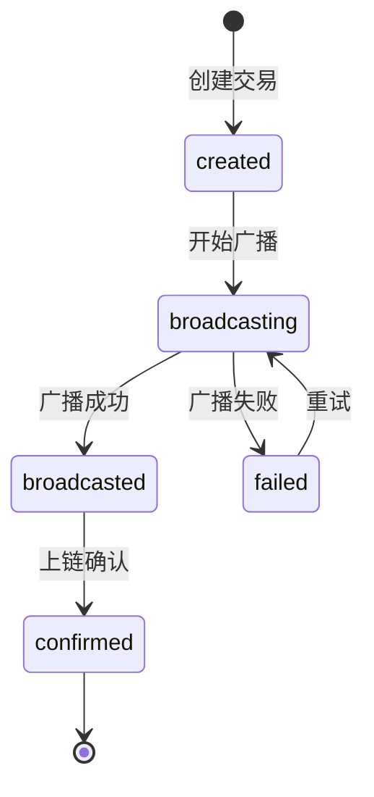

# Pending Transaction Service

> 源码: [`src/services/transaction/pending-tx.ts`](https://github.com/BioforestChain/KeyApp/blob/main/src/services/transaction/pending-tx.ts)

## 概述

PendingTxService 管理**未上链交易**的本地存储和状态跟踪。它专注于交易的生命周期状态管理，不关心交易内容本身（`rawTx` 是不透明的）。

### 核心设计原则

1. **Schema-first**: 使用 Zod 定义所有数据结构
2. **状态管理为核心**: 专注于交易生命周期，不解析交易内容
3. **支持任意交易类型**: 转账、销毁、质押等都适用
4. **可扩展的过期检查**: 支持不同链的过期判定逻辑

---

## 交易状态机



| 状态 | 描述 | UI 颜色 |
|------|------|---------|
| `created` | 交易已创建，待广播 | 🔵 Blue |
| `broadcasting` | 广播中 | 🔵 Blue + 动画 |
| `broadcasted` | 广播成功，等待上链 | 🟡 Amber |
| `confirmed` | 已上链确认 | 🟢 Green |
| `failed` | 广播失败 | 🔴 Red |

---

## Schema 定义

### PendingTxStatus

```typescript
export const PendingTxStatusSchema = z.enum([
  'created',      // 交易已创建，待广播
  'broadcasting', // 广播中
  'broadcasted',  // 广播成功，待上链
  'confirmed',    // 已上链确认
  'failed',       // 广播失败
])
```

### PendingTxMeta

用于 UI 展示的最小元数据（可选）：

```typescript
export const PendingTxMetaSchema = z.object({
  type: z.string().optional(),           // 交易类型 (transfer, burn, stake...)
  displayAmount: z.string().optional(),  // 展示金额
  displaySymbol: z.string().optional(),  // 展示符号
  displayToAddress: z.string().optional(), // 目标地址
}).passthrough()  // 允许扩展字段
```

### PendingTx

```typescript
export const PendingTxSchema = z.object({
  id: z.string(),                        // UUID
  walletId: z.string(),
  chainId: z.string(),
  fromAddress: z.string(),
  
  // 状态管理
  status: PendingTxStatusSchema,
  txHash: z.string().optional(),         // 广播成功后有值
  errorCode: z.string().optional(),
  errorMessage: z.string().optional(),
  retryCount: z.number().default(0),
  
  // 确认信息
  confirmedBlockHeight: z.number().optional(),
  confirmedAt: z.number().optional(),
  
  // 时间戳
  createdAt: z.number(),
  updatedAt: z.number(),
  
  // 交易数据（不透明）
  rawTx: z.unknown(),
  meta: PendingTxMetaSchema.optional(),
})
```

---

## Service API

```typescript
export const pendingTxServiceMeta = defineServiceMeta('pendingTx', (s) =>
  s.description('未上链交易管理服务')
    
    // 查询
    .api('getAll', z.object({ walletId: z.string() }), z.array(PendingTxSchema))
    .api('getById', z.object({ id: z.string() }), PendingTxSchema.nullable())
    .api('getByStatus', z.object({ walletId, status }), z.array(PendingTxSchema))
    .api('getPending', z.object({ walletId }), z.array(PendingTxSchema))
    
    // 生命周期管理
    .api('create', CreatePendingTxInputSchema, PendingTxSchema)
    .api('updateStatus', UpdatePendingTxStatusInputSchema, PendingTxSchema)
    .api('incrementRetry', z.object({ id: z.string() }), PendingTxSchema)
    
    // 清理
    .api('delete', z.object({ id: z.string() }), z.void())
    .api('deleteConfirmed', z.object({ walletId: z.string() }), z.void())
    .api('deleteExpired', z.object({ walletId, maxAge, currentBlockHeight? }), z.number())
    .api('deleteAll', z.object({ walletId: z.string() }), z.void())
)
```

---

## 使用示例

### 创建并广播交易

```typescript
import { pendingTxService } from '@/services/transaction'

// 1. 创建交易记录
const pendingTx = await pendingTxService.create({
  walletId,
  chainId: 'bfmeta',
  fromAddress,
  rawTx: transaction,  // 原始交易对象
  meta: {
    type: 'transfer',
    displayAmount: '100.5',
    displaySymbol: 'BFM',
    displayToAddress: toAddress,
  },
})

// 2. 更新为广播中
await pendingTxService.updateStatus({ id: pendingTx.id, status: 'broadcasting' })

// 3. 广播成功
await pendingTxService.updateStatus({ 
  id: pendingTx.id, 
  status: 'broadcasted',
  txHash: result.txHash,
})

// 或广播失败
await pendingTxService.updateStatus({
  id: pendingTx.id,
  status: 'failed',
  errorCode: '001-11028',
  errorMessage: '资产余额不足',
})
```

### 查询待处理交易

```typescript
// 获取所有未确认的交易
const pending = await pendingTxService.getPending({ walletId })

// 获取特定状态的交易
const failed = await pendingTxService.getByStatus({ walletId, status: 'failed' })
```

### 清理过期交易

```typescript
// 清理超过 24 小时的已确认/失败交易
const cleanedCount = await pendingTxService.deleteExpired({ 
  walletId, 
  maxAge: 24 * 60 * 60 * 1000,
  currentBlockHeight: 1000000, // 可选，用于 BioChain 区块高度过期检查
})
```

---

## 过期检查器

支持不同链的过期判定逻辑：

```typescript
// BioChain 使用 effectiveBlockHeight 判断过期
export const bioChainExpirationChecker: ExpirationChecker = {
  isExpired(rawTx: unknown, currentBlockHeight: number): boolean {
    const tx = rawTx as { effectiveBlockHeight?: number }
    if (typeof tx?.effectiveBlockHeight === 'number') {
      return currentBlockHeight > tx.effectiveBlockHeight
    }
    return false
  }
}

// 获取链对应的检查器
const checker = getExpirationChecker('bfmeta') // returns bioChainExpirationChecker
const checker = getExpirationChecker('ethereum') // returns undefined
```

---

## PendingTxManager

> 源码: [`src/services/transaction/pending-tx-manager.ts`](https://github.com/BioforestChain/KeyApp/blob/main/src/services/transaction/pending-tx-manager.ts)

自动化管理器，提供：

1. **自动重试**: 失败的交易自动重试（最多 3 次）
2. **状态同步**: 定时检查 `broadcasted` 交易是否已上链
3. **订阅机制**: UI 可订阅状态变化
4. **通知集成**: 状态变化时发送通知

### 使用

```typescript
import { pendingTxManager } from '@/services/transaction'

// 启动管理器
pendingTxManager.start()

// 订阅状态变化
const unsubscribe = pendingTxManager.subscribe((tx) => {
  console.log('Transaction updated:', tx.id, tx.status)
})

// 手动重试
await pendingTxManager.retryBroadcast(txId, chainConfigState)

// 同步钱包交易状态
await pendingTxManager.syncWalletPendingTransactions(walletId, chainConfigState)
```

---

## 配合 Hook 使用

```typescript
import { usePendingTransactions } from '@/hooks/use-pending-transactions'

function PendingTxSection({ walletId }: { walletId: string }) {
  const { 
    transactions, 
    isLoading, 
    retryTransaction, 
    deleteTransaction,
    clearAllFailed,
  } = usePendingTransactions(walletId)
  
  return (
    <PendingTxList
      transactions={transactions}
      onRetry={retryTransaction}
      onDelete={deleteTransaction}
      onClearAllFailed={clearAllFailed}
    />
  )
}
```

---

## 存储实现

使用 IndexedDB 存储，支持以下索引：

- `by-wallet`: 按钱包 ID 查询
- `by-status`: 按状态查询
- `by-wallet-status`: 复合索引

数据库配置：
- 名称: `bfm-pending-tx-db`
- 版本: 1
- Store: `pendingTx`

---

## 相关文档

- [Transaction Service](./03-Transaction.md) - 交易历史服务
- [Transaction Lifecycle](../../10-Wallet-Guide/03-Transaction-Flow/01-Lifecycle.md) - 交易生命周期
- [BioForest SDK](../05-BioForest-SDK/01-Core-Integration.md) - SDK 集成
