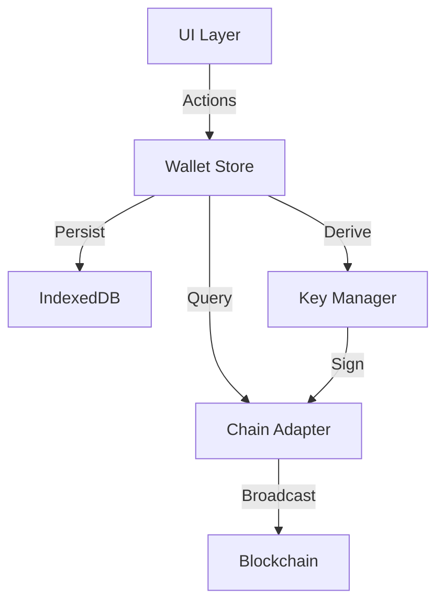

# 00. 钱包业务架构 (Overview)

钱包业务是 KeyApp 的基石。它跨越了所有技术层级。

## 业务分层图

## 核心实体 (`Wallet`)

一个 `Wallet` 对象聚合了该身份下的所有信息：
*   **Identity**: ID, Name, Theme
*   **Security**: Encrypted Mnemonic, Wallet Lock
*   **Multi-Chain**: `chainAddresses` 数组，每个元素对应一条链的地址和资产。

这与传统的单链钱包不同，KeyApp 的 `Wallet` 是天然多链的。
