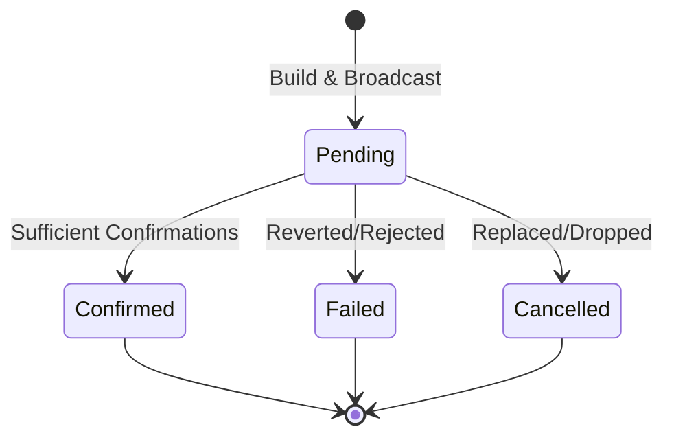

# Transaction Lifecycle

## Overview

Transactions in KeyApp follow a unified lifecycle state machine, regardless of the underlying blockchain (BioForest, EVM, UTXO, etc.). This ensures a consistent user experience across different networks.

## Lifecycle States

The transaction lifecycle is normalized into four primary states:

| State | Description | Color Code |
|-------|-------------|------------|
| `pending` | Broadcasted but not yet included in a block (or insufficient confirmations). | 🟨 Yellow |
| `confirmed` | Included in a block with sufficient confirmations. | 🟩 Green |
| `failed` | Execution failed (e.g., out of gas, revert) or rejected by network. | 🟥 Red |
| `cancelled` | Replaced by a new transaction (nonce reuse) or dropped from mempool. | ⬜ Gray |

## Data Flow

### 1. Creation (`Build`)

- **Input**: `TransferParams` (from, to, amount, memo)
- **Service**: `buildTransaction`
- **Output**: `UnsignedTransaction` (chain-specific payload)

### 2. Signing (`Sign`)

- **Input**: `UnsignedTransaction`, `PrivateKey`
- **Service**: `signTransaction`
- **Output**: `SignedTransaction` (payload + signature)

### 3. Broadcasting (`Broadcast`)

- **Input**: `SignedTransaction`
- **Service**: `broadcastTransaction`
- **Output**: `TransactionHash` (txID)

### 4. Monitoring (`Watch`)

- **Input**: `TransactionHash`
- **Service**: `getTransactionStatus`
- **Mechanism**: Polling or WebSocket subscription
- **Normalization**:
  - `BioforestTransactionService`: Queries `/transactions/query`.
  - `EtherscanProvider`: Queries `/api?module=transaction`.
  - `BtcWalletProvider`: Queries `/api/v2/tx`.

## Transaction Types

The `WrappedTransactionProvider` normalizes various chain-specific operation types into a generic `Action` enum:

- **`transfer`**: Native token transfer.
- **`contract`**: Smart contract interaction.
- **`stake` / `unstake`**: Staking operations.
- **`issueAsset`**: Asset creation (BioForest).
- **`dapp`**: Miniapp interaction (BioForest).

## UI Representation

Transactions are displayed using the `TransactionItem` and `TransactionStatus` components.

### Status Badge

Located in `src/components/transaction/transaction-status.tsx`.

- **Success**: Check icon, Green background.
- **Failed**: X icon, Red background.
- **Pending**: Clock icon, Yellow background.
- **Cancelled**: Ban icon, Gray background.

### History List

Located in `src/components/transaction/transaction-list.tsx`.

- Groups transactions by date.
- Shows directional icons (Incoming/Outgoing).
- Displays primary asset amount and symbol.
