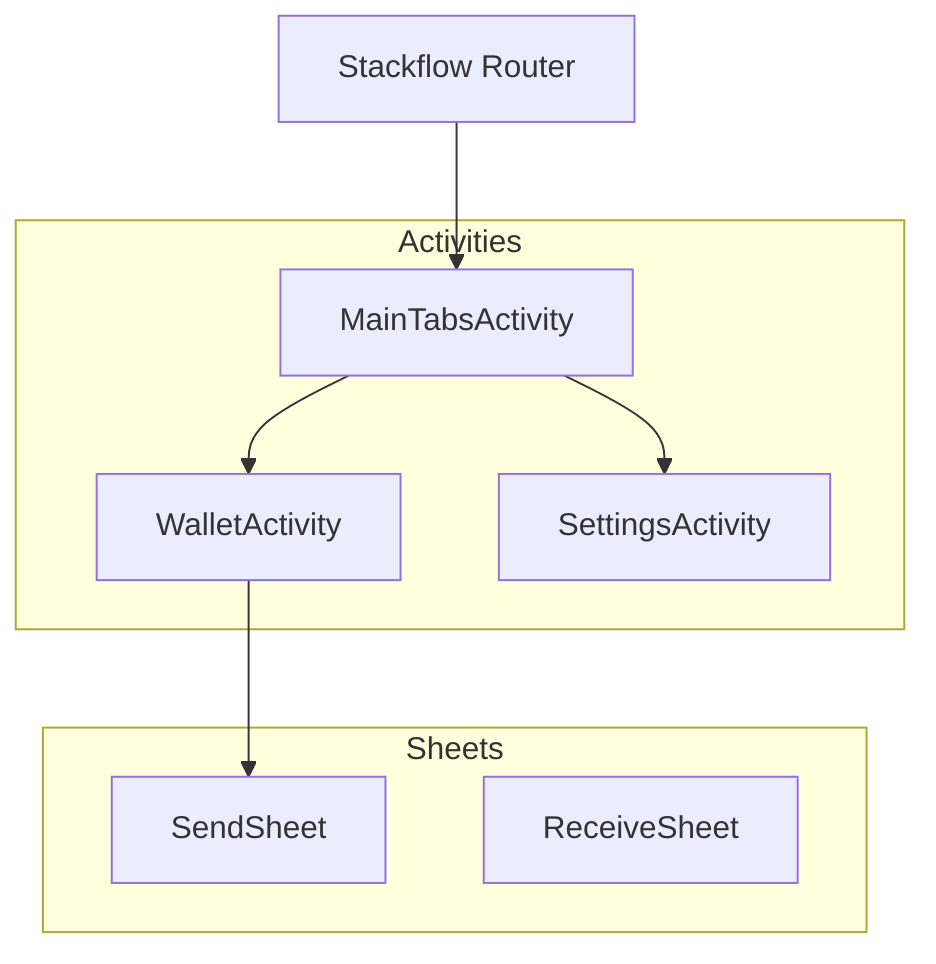

# 00. Shell 架构 (Overview)

Code: `src/stackflow/`

Shell 是用户与 WebOS 交互的第一界面。它负责管理所有的系统级应用（Activities）和它们之间的跳转关系。

## 核心组件：Stackflow

我们选用了 **Stackflow** 作为路由引擎，而不是 React Router。

### 为什么选择 Stackflow?
1.  **Stack-based Navigation**: 真正的堆栈式导航 (`push`, `pop`)，而不是 Web 的 History API (`forward`, `back`)。
2.  **Native Transitions**: 内置 iOS/Android 风格的转场动画。
3.  **State Persistence**: 页面在栈中被保留（keep-alive），返回时状态不丢失。

## 架构图

