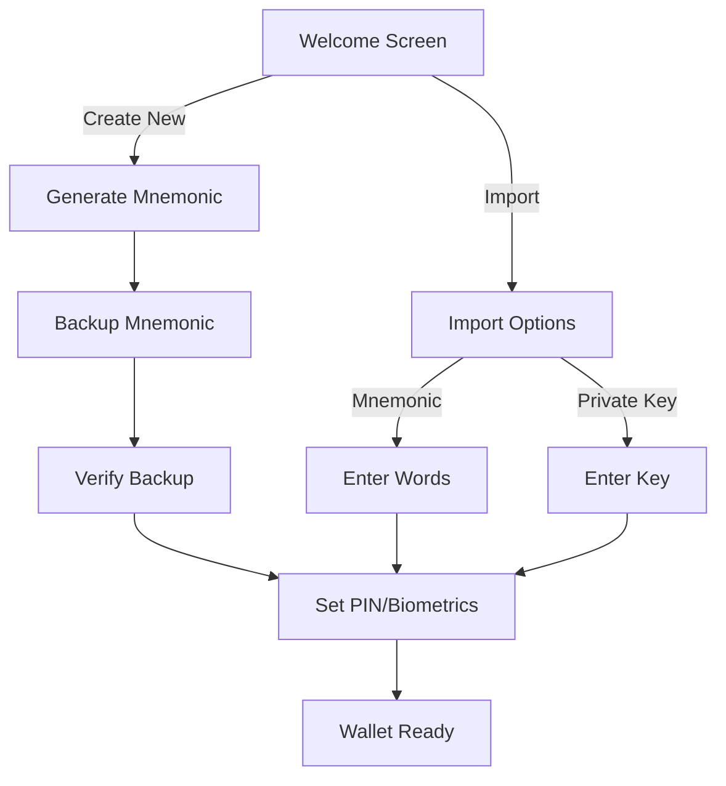

# System Flows

## Overview

System flows describe the high-level user journeys and system interactions within KeyApp, including onboarding, deep linking, and external app integration.

## Onboarding Flow

The onboarding process guides users to create or import a wallet.



### Components

- `CreateWalletSuccess`: Displays success message and prompts for next steps.
- `RecoverWalletForm`: Handles mnemonic or private key input.
- `MnemonicConfirmBackup`: Interactive grid to verify mnemonic words.

## Deep Linking

KeyApp supports deep links to handle payments and DApp interactions.

### Scheme

`keyapp://{action}?{params}`

### Supported Actions

1. **Payment**: `keyapp://pay?address={addr}&amount={amt}&asset={symbol}`
   - Opens the transfer screen pre-filled with details.
2. **DApp**: `keyapp://dapp?url={url}`
   - Launches a miniapp in the sandbox.

### Implementation

Handled by `src/stackflow/app-link.tsx` (Conceptual location, implementation details TBD).

## BioForest SDK Integration

The BioForest SDK (`src/services/bioforest-sdk`) is the core bridge for BioForest chain interactions.

- **Genesis Loading**: Fetches `{chainId}.json` from `/configs/genesis`.
- **Core Setup**: Initializes WASM/JS bundle dynamically.
- **Transaction Construction**: Uses `BFChainCore` to build and sign transactions.

```typescript
// Example: Transfer
const tx = await core.transactionController.createTransferTransactionJSON({ ... });
```
